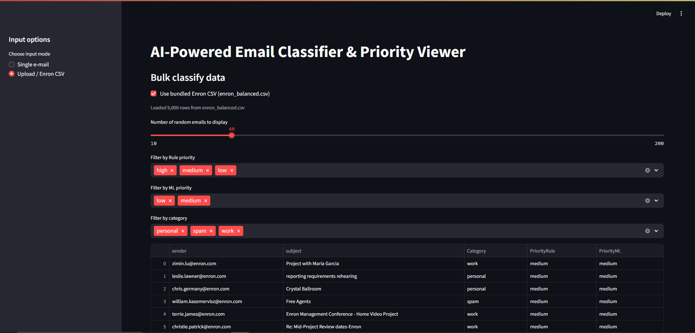

# AI‑Powered Email Classifier & Priority System

This system is **not web-hosted**. It runs locally using **Python + Streamlit** on Windows, macOS, or Linux.

## Required Datasets
Due to file size limits, `emails.csv` and `enron_labeled.csv` are not included in the repo.
Download them from:
https://drive.google.com/drive/folders/1_55jnBvkYNh-nBna0YRPKmQo77rFT3T1?usp=sharing
Place both files in the `data/` directory before running `retrain_all.py`

## Windows Setup Instructions

## 1. Clone and install dependencies

git clone <your-repo-url>
cd your-repo-name
python -m venv venv
venv\Scripts\activate
pip install -r requirements.txt

## 2. Re‑train everything (models, charts, error sample)
Run retrain_all.py

## 3. Launch the GUI
streamlit run src/app.py in terminal

This Streamlit UI displays the output of my AI email classification system. It loads Enron data, applies both rule-based and ML models to label each email by category and priority, and enables real-time filtering.

**Tech used**: Python, scikit-learn, pandas, Streamlit
**Key features**: Bulk CSV upload, dynamic filtering, ML + rule hybrid logic, and live result rendering.

## Screenshot

